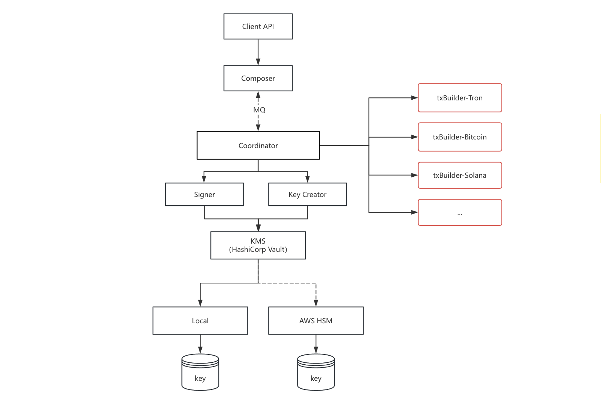

# txbuilder-ethereum

Ethereum 区块链交易构造 gRPC 服务，提供地址验证、余额检查、交易原始数据构造、交易广播等 API。

## 概述



**职责说明**：
- **txbuilder-ethereum**：负责 Ethereum 区块链的所有细节（EIP-1559 交易构造、RLP 编码、JSON-RPC 调用）
- **Coordinator**：只需调用接口构造交易、调用 KMS 请求签名、调用广播

## 环境要求

- Go 1.25+
- protoc（用于编译 proto 文件）

## 目录结构

```
txbuilder-ethereum/
├── cmd/txbuilder-ethereum/
│   └── main.go              # 程序入口，gRPC 服务启动
├── internal/
│   ├── config/              # TOML 配置加载 & 日志初始化
│   │   ├── config.go
│   │   └── config_test.go
│   ├── service/             # gRPC handler 实现
│   │   ├── service.go
│   │   └── service_test.go
│   └── ethereum/            # Ethereum 相关工具
│       ├── address.go       # 地址校验（0x + 40 hex）
│       ├── address_test.go
│       └── rpc.go           # Ethereum 节点 JSON-RPC 客户端
├── grpc/
│   ├── txbuilder.proto      # gRPC 服务和消息定义
│   ├── txbuilder.pb.go     # 生成的 protobuf 代码
│   └── txbuilder_grpc.pb.go
├── config/
│   └── config.toml          # 默认配置文件（Sepolia 测试网）
└── .golangci.yml           # linter 配置
```

## gRPC 接口

服务在 `host:port`（默认 `127.0.0.1:50052`）上暴露 `TxBuilder` gRPC 服务。

### 1. VerifyAddress

验证 Ethereum 地址（`0x` 前缀 + 40 个十六进制字符）。

```protobuf
rpc VerifyAddress(VerifyAddressRequest) returns (VerifyAddressResponse);
```

**请求：**

| 字段       | 类型     | 说明        |
| -------- | ------ | --------- |
| trace_id | string | 追踪 ID（必填） |
| address  | string | Ethereum 地址   |

**响应：**

| 字段       | 类型   | 说明     |
| -------- | ---- | ------ |
| is_valid | bool | 地址是否合法 |

### 2. VerifyContractAddress

验证 Ethereum 合约地址（格式与普通地址相同）。

```protobuf
rpc VerifyContractAddress(VerifyContractAddressRequest) returns (VerifyContractAddressResponse);
```

**请求：**

| 字段       | 类型     | 说明        |
| -------- | ------ | --------- |
| trace_id | string | 追踪 ID（必填） |
| address  | string | 合约地址      |

**响应：**

| 字段       | 类型   | 说明     |
| -------- | ---- | ------ |
| is_valid | bool | 地址是否合法 |

### 3. CheckSufficientBalance

检查账户余额是否足够发起转账。

```protobuf
rpc CheckSufficientBalance(CheckSufficientBalanceRequest) returns (CheckSufficientBalanceResponse);
```

**请求：**

| 字段            | 类型     | 说明                                     |
| ------------- | ------ | -------------------------------------- |
| trace_id      | string | 追踪 ID（必填）                              |
| chain_code    | string | 链码，如 "ethereum"、"sepolia"                   |
| coin          | string | 币种 ID                                  |
| from_address  | string | 发送方地址（0x 开头）                            |
| amount        | string | 转账金额（ETH 单位为 wei，代币为最小单位）              |
| contract      | string | 代币合约地址      |

**响应：**

| 字段            | 类型   | 说明     |
| ------------- | ---- | ------ |
| is_sufficient | bool | 余额是否充足 |

### 4. BuildSignRawData

构造待签名的交易原始数据（RLP 编码）。

```protobuf
rpc BuildSignRawData(BuildSignRawDataRequest) returns (BuildSignRawDataResponse);
```

**请求：**

| 字段            | 类型     | 说明                                |
| ------------- | ------ | --------------------------------- |
| trace_id      | string | 业务根据 ID（必填，最多 36 字符）                |
| chain_code    | string | 链码，如 "ethereum"                              |
| coin          | string | 币种 ID                             |
| coin_symbol   | string | 代币符号                              |
| from_address  | string | 发送方地址（0x 开头）                           |
| to_address    | string | 接收方地址（0x 开头）                           |
| amount        | string | 金额（必须是纯数字字符串，单位为 wei）                 |
| contract      | string | 代币合约地址 |

**响应：**

| 字段      | 类型     | 说明                                    |
| ------- | ------ | ------------------------------------- |
| msg     | string | Keccak-256 哈希（十六进制字符串，用于签名）        |
| raw_data | string | 未签名 RLP 编码交易（十六进制字符串），用于 Coordinator 签名 |

### 5. TxBroadcast

广播已签名的交易数据到 Ethereum 网络。

```protobuf
rpc TxBroadcast(TxBroadcastRequest) returns (TxBroadcastResponse);
```

**请求：**

| 字段       | 类型     | 说明                         |
| -------- | ------ | -------------------------- |
| trace_id | string | 追踪 ID（必填）                   |
| raw_data | string | 已签名 RLP 编码交易（十六进制字符串，1-4096 字符）   |
| signature | string | 外部传入的签名数据，格式为 R + S + V（V 只有 0 或 1，表示 R.y 坐标的奇偶性） |

**响应：**

| 字段      | 类型   | 说明      |
| ------- | ---- | ------- |
| success | bool | 广播是否成功 |
| tx_hash | string | 交易哈希，广播成功后返回 |

## 配置

默认配置文件：`config/config.toml`

```toml
[chain]
chain_code = "ethereum"
rpc_url = "https://rpc.sepolia.org"
chain_id = 11155111

[grpc]
host = "127.0.0.1"
port = 50052

[log]
rotation = true
file_path = ""
max_size_mb = 100
max_backups = 10
max_age = 30
compress = true
format = "terminal"
verbosity = 3
vmodule = ""
```

## 调用示例

### 使用 grpcurl

先启动服务，再用 grpcurl 调用：

```bash
# 启动服务
go run ./cmd/txbuilder-ethereum/main.go

# 验证地址
grpcurl -plaintext -d '{
  "trace_id": "test-001",
  "address": "0xd8dA6BF26964aF9D7eEd9e03E53415D37aA96045"
}' localhost:50052 chain.TxBuilder/VerifyAddress

# 检查余额（ETH）
grpcurl -plaintext -d '{
  "trace_id": "test-002",
  "chain_code": "ethereum",
  "coin": "eth",
  "from_address": "0xd8dA6BF26964aF9D7eEd9e03E53415D37aA96045",
  "amount": "1000000000000000"
}' localhost:50052 chain.TxBuilder/CheckSufficientBalance

# 构造 ETH 转账交易
grpcurl -plaintext -d '{
  "trace_id": "tx-001",
  "chain_code": "ethereum",
  "coin": "eth",
  "coin_symbol": "ETH",
  "from_address": "0xd8dA6BF26964aF9D7eEd9e03E53415D37aA96045",
  "to_address": "0xAb5801a7D398351b8bE11C439e05C5B3259aeC9b",
  "amount": "1000000000000000"
}' localhost:50052 chain.TxBuilder/BuildSignRawData
# 响应示例: {"msg": "...", "raw_data": "..."}

# 广播已签名的交易（raw_data 包含签名）
grpcurl -plaintext -d '{
  "trace_id": "broadcast-001",
  "raw_data": "0xf86c018504a817c80082520894d8da6bf26964af9d7eed9e03e53415d37aa960458088016345785d8a0000801ca0798c92bfb0d1dfccba6f0912a8f03d9e1bdfef5ee3de0bd67c7c5b97425d38b6",
  "signature": ""
}' localhost:50052 chain.TxBuilder/TxBroadcast
```

### Go 客户端示例

```go
package main

import (
	"context"
	"fmt"

	"github.com/koku-web3/txbuilder-ethereum/grpc"
	"google.golang.org/grpc"
	"google.golang.org/grpc/credentials/insecure"
)

func main() {
	conn, err := grpc.NewClient("localhost:50052", grpc.WithTransportCredentials(insecure.NewCredentials()))
	if err != nil {
		panic(err)
	}
	defer conn.Close()

	client := grpc.NewTxBuilderClient(conn)
	ctx := context.Background()

	// 验证地址
	resp, err := client.VerifyAddress(ctx, &grpc.VerifyAddressRequest{
		TraceId: "test-001",
		Address: "0xd8dA6BF26964aF9D7eEd9e03E53415D37aA96045",
	})
	if err != nil {
		panic(err)
	}
	fmt.Printf("地址合法: %v\n", resp.IsValid)

	// 构造 ETH 转账
	txResp, err := client.BuildSignRawData(ctx, &grpc.BuildSignRawDataRequest{
		TraceId:       "tx-001",
		ChainCode:   "ethereum",
		CoinId:      "eth",
		IsBasicCoin: true,
		CoinSymbol:  "ETH",
		FromAddress: "0xd8dA6BF26964aF9D7eEd9e03E53415D37aA96045",
		ToAddress:   "0xAb5801a7D398351b8bE11C439e05C5B3259aeC9b",
		Amount:      "1000000000000000",
	})
	if err != nil {
		panic(err)
	}
	fmt.Printf("签名消息 (Keccak-256): %s\n", txResp.Msg)
}
```

## 开发

### Docker 部署

本项目支持 Docker 容器化部署。

#### 前置条件

- Docker 20.10+
- Docker Compose v2.0+

#### 快速启动

```bash
# 构建并启动服务
docker-compose up -d

# 查看服务状态
docker-compose ps

# 查看日志
docker-compose logs -f
```

#### 配置说明

配置文件位于 `./config/config.toml`，通过 volume 挂载到容器内 `/app/config` 目录。

**重要**：默认配置监听 `127.0.0.1:50052`，Docker 部署时需改为监听所有地址：

```toml
[grpc]
host = "0.0.0.0"  # 改为 0.0.0.0 以允许外部访问
port = 50052
```

#### 端口说明

| 端口 | 说明 |
| ---- | ---- |
| 50052 | gRPC 服务端口 |

#### 常用命令

```bash
# 停止服务
docker-compose down

# 重新构建（代码变更后）
docker-compose up -d --build

# 进入容器调试
docker exec -it txbuilder-ethereum sh

# 查看服务日志
docker-compose logs -f txbuilder-ethereum
```

#### 测试 gRPC 服务

服务启动后，可使用 grpcurl 测试：

```bash
# 验证地址
grpcurl -plaintext -d '{
  "trace_id": "test-001",
  "address": "0xd8dA6BF26964aF9D7eEd9e03E53415D37aA96045"
}' localhost:50052 chain.TxBuilder/VerifyAddress
```

### 生成 protobuf 代码

### 生成 protobuf 代码

```bash
# 进入项目根目录
cd ./txbuilder-ethereum

# 重新生成 Go 代码
protoc --go_out=. --go_opt=paths=source_relative \
       --go-grpc_out=. --go-grpc_opt=paths=source_relative \
       grpc/txbuilder.proto
```

需要安装：`protoc`、`protoc-gen-go`、`protoc-gen-go-grpc`。

### 运行测试

```bash
go test ./...
```

### 代码检查

```bash
golangci-lint run ./...
```

## 许可证

见 [COPYING](./COPYING)。
