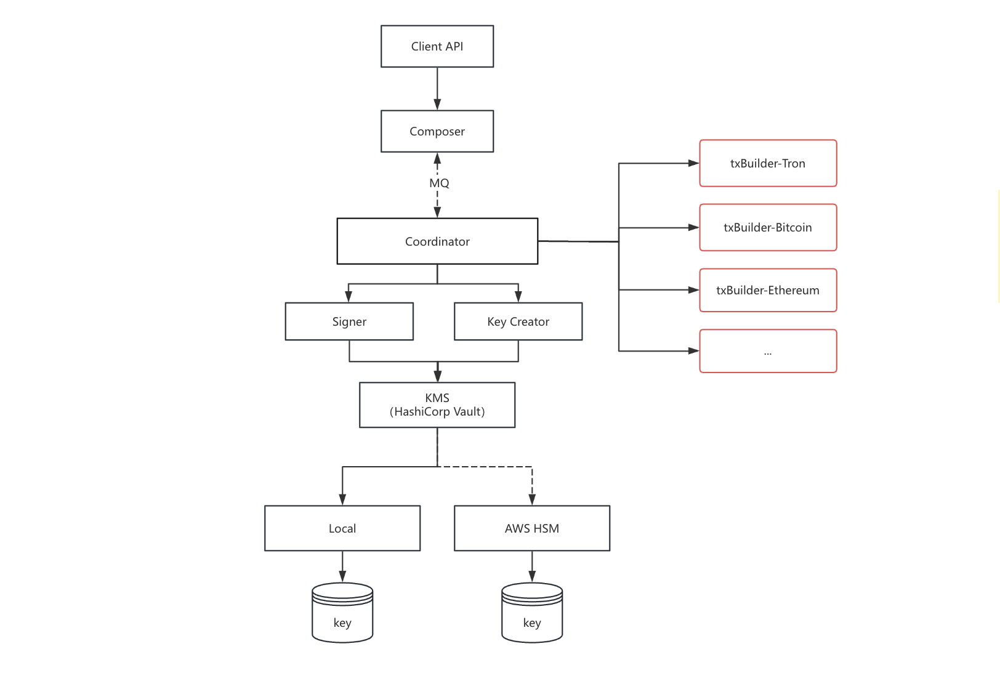

# txbuilder-ethereum

Ethereum 区块链交易构造 gRPC 服务，提供地址验证、余额检查、交易原始数据构造、交易广播等 API。

## 概述



**职责说明**：

- **txbuilder-ethereum**：负责 Ethereum 区块链的所有细节（EIP-1559 交易构造、RLP 编码、JSON-RPC 调用）
- **Coordinator**：只需调用接口构造交易、调用 KMS 请求签名、调用广播

## 环境要求

- Go 1.26+
- protoc（用于编译 proto 文件）

## 目录结构

```
txbuilder-ethereum/
├── cmd/txbuilder-ethereum/
│   └── main.go              # 程序入口，gRPC 服务启动
├── internal/
│   ├── config/              # TOML 配置加载 & 日志初始化
│   │   ├── config.go
│   ├── service/             # gRPC handler 实现
│   └── ethereum/            # Ethereum 相关工具
├── grpc/
│   ├── txbuilder.proto      # gRPC 服务和消息定义
│   ├── txbuilder.pb.go     # 生成的 protobuf 代码
│   └── txbuilder_grpc.pb.go
├── config/
│   └── config.toml          # 默认配置文件（Sepolia 测试网）
└── .golangci.yml           # linter 配置
```


## gRPC 返回值

所有 gRPC 接口均使用标准 gRPC 状态码作为返回值。错误响应格式为：

```json
{
  "code": 3,
  "message": "invalid trace_id",
  "<自定义字段>": ""
}
```


### 错误码说明


| 错误码 | 名称                | 说明                      |
| --- | ----------------- | ----------------------- |
| 3   | `InvalidArgument` | 客户端传入的参数无效，如格式错误、缺少必需参数 |
| 13  | `Internal`        | 服务端内部错误，通常表示代码 bug      |


### InvalidArgument 返回场景

当客户端传入的参数不符合要求时返回，常见场景：

- `trace_id` 为空或长度超出范围
- `address` 格式不正确（非 `0x` 开头、非 40 位十六进制）
- `amount` 格式错误（非数字字符串）


### Internal 返回场景

当服务端处理请求时发生内部错误：

- RPC 调用失败（节点连接问题）
- 序列化/反序列化错误


## gRPC 接口

服务在 `host:port`（默认 `127.0.0.1:51051`）上暴露 `TxBuilder` gRPC 服务。

### 1. VerifyAddress

验证 Ethereum 地址（`0x` 前缀 + 40 个十六进制字符），支持 EIP-55 校验和格式验证。

**验证规则：**

- 如果地址是 EIP-55 格式（混合大小写），则验证校验和是否正确
- 如果地址是纯小写或纯大写，则只验证基本格式

```protobuf
rpc VerifyAddress(VerifyAddressRequest) returns (VerifyAddressResponse);
```

**请求：**


| 字段       | 类型     | 说明          |
| -------- | ------ | ----------- |
| trace_id | string | 追踪 ID（必填）   |
| address  | string | Ethereum 地址 |


**响应：**


| 字段       | 类型   | 说明     |
| -------- | ---- | ------ |
| is_valid | bool | 地址是否合法 |


### 2. VerifyContractAddress

验证 Ethereum 合约地址（格式与普通地址相同）。

```protobuf
rpc VerifyContractAddress(VerifyContractAddressRequest) returns (VerifyContractAddressResponse);
```

**请求：**


| 字段       | 类型     | 说明        |
| -------- | ------ | --------- |
| trace_id | string | 追踪 ID（必填） |
| address  | string | 合约地址      |


**响应：**


| 字段       | 类型   | 说明     |
| -------- | ---- | ------ |
| is_valid | bool | 地址是否合法 |


### 3. ConvertAddress

将 PKIX 格式的 PEM 公钥转换为 Ethereum 地址（`0x` + 40 hex，含 EIP-55 校验和）。

```protobuf
rpc ConvertAddress(ConvertAddressRequest) returns (ConvertAddressResponse);
```

**请求：**


| 字段       | 类型                         | 说明                |
| -------- | -------------------------- | ----------------- |
| trace_id | string                     | 追踪 ID（必填，1-36 字符） |
| keys     | repeated PublicKeysRequest | 公钥列表（必填，最多 100 条） |


**PublicKeysRequest：**


| 字段              | 类型     | 说明                               |
| --------------- | ------ | -------------------------------- |
| account_index   | uint32 | 账户索引（原样透传）                       |
| pkix_pubkey_pem | string | PKIX 标准的公钥 PEM 格式（必填，最多 4096 字符） |


**响应：**


| 字段   | 类型                          | 说明     |
| ---- | --------------------------- | ------ |
| keys | repeated PublicKeysResponse | 转换结果列表 |


**PublicKeysResponse：**


| 字段            | 类型     | 说明                                  |
| ------------- | ------ | ----------------------------------- |
| account_index | uint32 | 账户索引（与请求对应）                         |
| address       | string | Ethereum 地址（`0x` + 40 hex，含 EIP-55） |


### 4. CheckSufficientBalance

检查账户余额是否足够发起转账。

```protobuf
rpc CheckSufficientBalance(CheckSufficientBalanceRequest) returns (CheckSufficientBalanceResponse);
```

**请求：**


| 字段           | 类型     | 说明                                    |
| ------------ | ------ | ------------------------------------- |
| trace_id     | string | 追踪 ID（必填，1-36 字符）                     |
| chain_code   | string | 链码（必填，1-36 字符），如 "ethereum"、"sepolia" |
| coin         | string | 币种 ID（必填，1-36 字符）                     |
| from_address | string | 发送方地址（必填，1-256 字符，0x 开头）              |
| amount       | string | 转账金额（必填，纯数字字符串，单位为 wei）               |
| contract     | string | 代币合约地址（非必填，1-256 字符；空串表示主链币 ETH）      |


**响应：**


| 字段                  | 类型   | 说明                                 |
| ------------------- | ---- | ---------------------------------- |
| is_coin_sufficient  | bool | 主链币（如 ETH）余额是否足够转账                 |
| is_token_sufficient | bool | 代币余额是否足够（当 contract 非空时需要同时判断两个字段） |


### 5. BuildSignRawData

构造待签名的交易原始数据（RLP 编码）。根据 `contract` 字段判断转账类型：空串构造 ETH 转账，非空构造 ERC-20 代币转账。

```protobuf
rpc BuildSignRawData(BuildSignRawDataRequest) returns (BuildSignRawDataResponse);
```

**请求：**


| 字段           | 类型     | 说明                               |
| ------------ | ------ | -------------------------------- |
| trace_id     | string | 业务追踪 ID（必填，1-36 字符）              |
| chain_code   | string | 链码（必填，1-36 字符）                   |
| coin         | string | 币种 ID（必填，1-36 字符）                |
| coin_symbol  | string | 代币符号（必填，1-36 字符）                 |
| from_address | string | 发送方地址（必填，1-256 字符，0x 开头）         |
| to_address   | string | 接收方地址（必填，1-256 字符，0x 开头）         |
| amount       | string | 金额（必填，纯数字字符串，单位为 wei）            |
| contract     | string | 代币合约地址（非必填，1-256 字符；空串表示主链币 ETH） |


**响应：**


| 字段       | 类型     | 说明                                          |
| -------- | ------ | ------------------------------------------- |
| msg      | string | Keccak-256 哈希（十六进制字符串，EIP-1559 签名消息）        |
| raw_data | string | 未签名 RLP 编码交易（十六进制字符串），由 Coordinator 签名后用于广播 |


### 6. TxBroadcast

广播已签名的交易数据到 Ethereum 网络。

```protobuf
rpc TxBroadcast(TxBroadcastRequest) returns (TxBroadcastResponse);
```

**请求：**


| 字段           | 类型     | 说明                                                |
| ------------ | ------ | ------------------------------------------------- |
| trace_id     | string | 追踪 ID（必填）                                         |
| raw_data     | string | 已签名 RLP 编码交易（十六进制字符串，1-4096 字符）                   |
| signature    | string | 外部传入的签名数据，格式为 R + S + V（V 只有 0 或 1，表示 R.y 坐标的奇偶性） |
| from_address | string | 交易发起地址（必填，1-256 字符）。用于校验签名恢复出的地址是否一致              |


**响应：**


| 字段      | 类型     | 说明           |
| ------- | ------ | ------------ |
| success | bool   | 广播是否成功       |
| tx_hash | string | 交易哈希，广播成功后返回 |


**签名发起方校验（重要）：**

服务在广播前会用 `types.Sender` 从签名中反推交易发起方，并与 `from_address` 比对，不一致则直接拒绝并返回 `InvalidArgument`：

```text
signature does not match from_address: signature recovers to 0x..., but from_address is 0x...
```

之所以必须做这一步：`WithSignature` 只组装 R/S/V，**不验证签名是否真的对应这笔交易的哈希**。若外部（Coordinator/KMS）签署的是错误的摘要（例如把 `raw_data` 而非 `msg` 送进签名，或对字符串而非 32 字节做了额外哈希），`ecrecover` 依然会成功，但恢复出的是另一个无关地址。若不加拦截，请求会飘到节点并被报成极易误导的：

```text
insufficient funds for gas * price + value: balance 0, tx cost ..., overshot ...
```

因为那个被误恢复出来的地址余额恰好为 0。**看到这个报错时，第一反应应当是签名摘要错配，而不是账户没钱。**

`from_address` 使用 `strings.EqualFold` 比对，因此 EIP-55 校验和格式与全小写写法均可。

### 7. GetBalance

查询指定地址的主链币或代币余额。

```protobuf
rpc GetBalance(GetBalanceRequest) returns (GetBalanceResponse);
```

**请求：**


| 字段       | 类型     | 说明                                 |
| -------- | ------ | ---------------------------------- |
| trace_id | string | 追踪 ID（必填，1-36 字符）                  |
| address  | string | 查询余额的地址（必填，1-256 字符，0x 开头）         |
| contract | string | 代币合约地址（非必填，1-256 字符；空串表示查询主链币 ETH） |


**响应：**


| 字段     | 类型     | 说明                           |
| ------ | ------ | ---------------------------- |
| amount | string | 余额（纯数字字符串，单位为最小单位，如以太坊为 wei） |


## 配置

默认配置文件：`config/config.toml`

```toml
[chain]
chain_code = "ethereum"
rpc_url = "https://ethereum-sepolia-rpc.publicnode.com"
chain_id = 11155111

[grpc]
host = "127.0.0.1"
port = 51051

[log]
rotation = true
file_path = ""
max_size_mb = 100
max_backups = 10
max_age = 30
compress = true
format = "terminal"
verbosity = 5
vmodule = ""
```


## 调用示例


### 使用 grpcurl

先启动服务，再用 grpcurl 调用：

```bash
# 启动服务
go run ./cmd/txbuilder-ethereum/main.go

# 转换公钥为地址（需要先从私钥导出 PEM 格式的 PKIX 公钥）
# 示例：用 openssl 生成 secp256k1 公钥 PEM，再调用 ConvertAddress
# openssl ecparam -name secp256k1 -genkey -out /tmp/key.pem
# openssl ec -in /tmp/key.pem -pubout -out /tmp/pub.pem
# cat /tmp/pub.pem
# 然后调用接口（替换下面的 pkix_pubkey_pem 为实际 PEM 内容）：
grpcurl -plaintext -d '{
  "trace_id": "convert-001",
  "keys": [
    {"account_index": 0, "pkix_pubkey_pem": "-----BEGIN PUBLIC KEY-----\nMFYwEAYHKoZIzj0CAQYFK4EEAAoDQgAE...\n-----END PUBLIC KEY-----\n"}
  ]
}' localhost:51051 txbuilder.TxBuilder/ConvertAddress

# 验证地址
grpcurl -plaintext -d '{
  "trace_id": "test-001",
  "address": "0xd8dA6BF26964aF9D7eEd9e03E53415D37aA96045"
}' localhost:51051 txbuilder.TxBuilder/VerifyAddress

# 检查余额（ETH）
grpcurl -plaintext -d '{
  "trace_id": "test-002",
  "chain_code": "ethereum",
  "coin": "eth",
  "from_address": "0xd8dA6BF26964aF9D7eEd9e03E53415D37aA96045",
  "amount": "1000000000000000"
}' localhost:51051 txbuilder.TxBuilder/CheckSufficientBalance

# 构造 ETH 转账交易
grpcurl -plaintext -d '{
  "trace_id": "tx-001",
  "chain_code": "ethereum",
  "coin": "eth",
  "coin_symbol": "ETH",
  "from_address": "0xd8dA6BF26964aF9D7eEd9e03E53415D37aA96045",
  "to_address": "0xAb5801a7D398351b8bE11C439e05C5B3259aeC9b",
  "amount": "1000000000000000"
}' localhost:51051 txbuilder.TxBuilder/BuildSignRawData
# 响应示例: {"msg": "...", "raw_data": "..."}

# 广播已签名的交易（raw_data 包含签名）
# 注意：from_address 必填，必须是实际签署者的地址，否则会被签名校验拒绝
grpcurl -plaintext -d '{
  "trace_id": "broadcast-001",
  "raw_data": "0xf86c018504a817c80082520894d8da6bf26964af9d7eed9e03e53415d37aa960458088016345785d8a0000801ca0798c92bfb0d1dfccba6f0912a8f03d9e1bdfef5ee3de0bd67c7c5b97425d38b6",
  "signature": "",
  "from_address": "0xd8dA6BF26964aF9D7eEd9e03E53415D37aA96045"
}' localhost:51051 txbuilder.TxBuilder/TxBroadcast
```


### Go 客户端示例

```go
package main

import (
	"context"
	"fmt"

	"github.com/koku-web3/txbuilder-ethereum/grpc"
	"google.golang.org/grpc"
	"google.golang.org/grpc/credentials/insecure"
)

func main() {
	conn, err := grpc.NewClient("localhost:51051", grpc.WithTransportCredentials(insecure.NewCredentials()))
	if err != nil {
		panic(err)
	}
	defer conn.Close()

	client := grpc.NewTxBuilderClient(conn)
	ctx := context.Background()

	// 验证地址
	resp, err := client.VerifyAddress(ctx, &grpc.VerifyAddressRequest{
		TraceId: "test-001",
		Address: "0xd8dA6BF26964aF9D7eEd9e03E53415D37aA96045",
	})
	if err != nil {
		panic(err)
	}
	fmt.Printf("地址合法: %v\n", resp.IsValid)

	// 构造 ETH 转账
	txResp, err := client.BuildSignRawData(ctx, &grpc.BuildSignRawDataRequest{
		TraceId:      "tx-001",
		ChainCode:    "ethereum",
		Coin:         "eth",
		CoinSymbol:   "ETH",
		FromAddress:  "0xd8dA6BF26964aF9D7eEd9e03E53415D37aA96045",
		ToAddress:    "0xAb5801a7D398351b8bE11C439e05C5B3259aeC9b",
		Amount:       "1000000000000000",
		Contract:     "", // 空串表示主链币 ETH；非空则为代币合约地址
	})
	if err != nil {
		panic(err)
	}
	fmt.Printf("签名消息 (Keccak-256): %s\n", txResp.Msg)
}
```


## 开发


### 生成 protobuf 代码

```bash
# 进入项目根目录
cd ./txbuilder-ethereum

# 重新生成 Go 代码
protoc --go_out=. --go_opt=paths=source_relative \
       --go-grpc_out=. --go-grpc_opt=paths=source_relative \
       grpc/txbuilder.proto
```

需要安装：`protoc`、`protoc-gen-go`、`protoc-gen-go-grpc`。

### 运行测试

```bash
go test ./...
```


### 代码检查

```bash
golangci-lint run ./...
```


### Docker 部署


#### 前置条件

- Docker 20.10+
- Docker Compose v2.0+


#### 本地开发

使用 `docker-compose.yml`（含 `build:` 块），代码变更后重新编译并启动：

```bash
# 构建并启动服务
docker compose up -d --build

# 查看服务状态
docker compose ps

# 查看日志
docker compose logs -f
```


#### 服务器生产部署

使用 `docker-compose.prod.yml`（无 `build:` 块），镜像从 GHCR 拉取：

```bash
# 拉取最新版本并启动
docker compose -f docker-compose.prod.yml pull
docker compose -f docker-compose.prod.yml up -d

# 指定版本（回滚）
IMAGE_TAG=v1.0.4 docker compose -f docker-compose.prod.yml up -d

# 查看服务状态
docker compose -f docker-compose.prod.yml ps

# 查看日志
docker compose -f docker-compose.prod.yml logs -f
```

首次部署前，需在服务器上创建外部网络：

```bash
docker network create koku-net
```


#### 配置说明

配置文件通过 volume 挂载覆盖镜像内默认配置：

- 本地：`./config/config.docker.toml` → 容器内 `/app/config/config.docker.toml`（只读）
- 生产：`./config/config.prod.toml` → 容器内 `/app/config/config.prod.toml`（只读）


#### 常用命令

```bash
# 停止服务
docker compose -f docker-compose.prod.yml down

# 重新拉取并部署
docker compose -f docker-compose.prod.yml pull && docker compose -f docker-compose.prod.yml up -d

# 进入容器调试
docker exec -it txbuilder-ethereum sh

# 查看服务日志
docker compose -f docker-compose.prod.yml logs -f
```


#### 测试 gRPC 服务

服务启动后，可使用 grpcurl 测试：

```bash
# 验证地址
grpcurl -plaintext -d '{
  "trace_id": "test-001",
  "address": "0xd8dA6BF26964aF9D7eEd9e03E53415D37aA96045"
}' localhost:51051 txbuilder.TxBuilder/VerifyAddress
```


#### 发布新版本

打 tag 触发 GitHub Actions 构建并推送镜像到 GHCR：

```bash
git tag v0.1.0
git push origin v0.1.0
```

镜像构建完成后，服务器上执行：

```bash
docker compose -f docker-compose.prod.yml pull && docker compose -f docker-compose.prod.yml up -d
```

